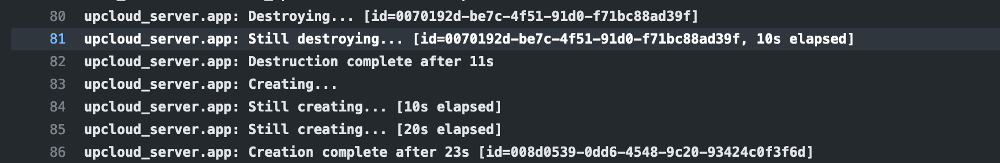
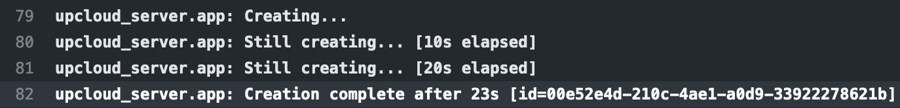

# Reducing Terraform Deployment Downtime

This GitHub repo demonstrates the usage of a couple of Terraform features (you can skip directly to them
[here](#trick1) and [here](#trick2)) that can reduce the downtime or unavailability of Terraform managed
resources. For this demonstration we've built an extremely simple Go HTTP server. We package this server
into a custom machine image using [Packer](https://www.packer.io) and the [UpCloud](https://upcloud.com)
Packer [plugin](https://github.com/UpCloudLtd/packer-plugin-upcloud). This custom image is deployed on to
an UpCloud server using Terraform.

## Repo Structure

This is a monorepo and all code is available here. These are the directories of interest:

* `go` - Our Go HTTP server.
* `packer` - Our Packer configuration
  * `packer/artefact` - Artefacts (scripts and systemd units) that are installed on the custom
    machine image.
* `terraform` - Our Terraform configuration
* `.github/workflows` - Our [GitHub Actions](https://github.com/features/actions) workflow

###  CI/CD

This project makes use of GitHub Actions and [Terraform Cloud](https://www.terraform.io/cloud) to deploy new version
of the demo application after every commit.

#### GitHub Action

GitHub Actions is a CI/CD tool baked into GitHub allowing us to define workflows for our code in the same
repository as the code itself.

The GitHub Action workflow doesn't change throughout the demo. It consists of 4 jobs:

* `build` - Build the Go HTTP server and push the artefact to GitHub Artifact cache. This is a fairly vanilla
  Go build job.
* `image` - Build the custom machine image using Packer. We are using the
  [`hashicorp-contib/setup-packer`](https://github.com/hashicorp-contrib/setup-packer) action as we also install a
  Packer plugin manually.
* `terraform` - This is a fairly vanilla Terraform build job but we do use the [`upctl`](https://github.com/UpCloudLtd/upcloud-cli) CLI tool to determine the latest custom machine image name.
* `image_tidy` - This use the `upctl` CLI tool to delete all but that last 5 images.

To replicate this workflow you will need to do the following in a fork of this repo:

* Edit `.github/workflows/build.yaml` and change `UPCLOUD_USERNAME` environment variables to a user that exists
  in your UpCloud account. I recommend creating a new user.
* Set the `UPCLOUD_API_PASSWORD` GitHub secret to the password for the above UpCloud user.
* Edit `terraform/backend.tf` and change the `organization` and `workspace/name` values to those that match your
  Terraform Cloud setup.
* Set the `TF_API_TOKEN` secret to your Terraform Cloud API token.

#### Terraform Cloud

Terraform Cloud is a managed service from HasiCorp that will run our Terraforom applies and manage and secure our
infrastructure state. It eliminates the need for custom tooling to manage Terraform in production. When running Terraform
in a CI/CD pipeline we need to be able to store our remote state, this is one of the reasons we are using Terrafrom Cloud.

To replicate this workflow you will need to do the following (assuming you've signed up to Terrafrom Cloud):

* Optionally, create a new organisation. You will need this to configure GitHub Actions.
* Create a new workspace. You will need this to configure GitHub Actions.
* Create a new Terraform Cloud API token for your user. You will also need this to configure GitHub Actions.
* In the workspace variable tab set these environment variables:
  * `UPCLOUD_USERNAME` - The name of a user within your account. I recommend creating a new user.
  * `UPCLOUD_PASSWORD` - The password of the above user. Remember to tick the 'sensitive' checkbox.

#### Packer

If you are following along the Packer configuration installs an SSH public key `packer/artefact/id_rsa_upcloud.pub`
which is useful for my debugging but you should replace this with the public part of a private SSH key you generate.

#### CI/CD Conclusion

With the above changes you should be able use the GitHub Action workflow to build and run your own experiments.

## Initial State (tag: [1.0](https://github.com/opencredo/upcloudzerodowntime/tree/1.0))

### Go HTTP Server

In this initial state we only ever respond with a simple "`(1.0) Hello, "/"`" message. This is a snippet of the code
that does this:

```go
	http.HandleFunc("/", func(w http.ResponseWriter, r *http.Request) {
		fmt.Fprintf(w, "(%s) Hello, %q", Version, html.EscapeString(r.URL.Path))
	})
```

### Packer

In the initial state we are using the `file` provisioner to copy across the following pertinent files:
* `demoapp` - Our HTTP server.
* `demoapp.service` - A systemd unit that starts the HTTP server when the machine comes up.

We then use a `shell` provisioner to:
* Update the server to the latest available packages.
* Copy the files above to their correct locations and give them the correct ownership and permissions
* Enable the `demoapp.service` systemd unit

Finally, a [Goss](https://goss.rocks/) provisioner is used that will use the `packer/artefact/goss.yaml` server
specification file to ensure that the resultant image matches what we are expecting.

### Terraform

The initial Terraform is really simple:

```terraform
resource "upcloud_server" "app" {
  hostname = "myapplication.com"
  zone     = "uk-lon1"
  plan     = "1xCPU-1GB"

  template {
    storage = var.template_id
    size    = 25
  }

  network_interface {
    type = "public"
  }
}
```

We are simply deploying an UpCloud server in the London region with a public IP using our newly create machine image.

### Experiment

If we were commit our code and config at this point it should all deploy nicely. We can determine the IP address of our
server by using the `upctl` CLI tool (this snippet assumes you only have 1 server in your account):

```bash
$ upctl server show $(upctl server list -o json | jq '.[0] | .uuid' -r)

  
  Common
    UUID:          0099b58a-c5f5-4a39-b63e-f6120d701f74     
    Hostname:      myapplication.com                        
    Title:         myapplication.com (managed by terraform) 
    Plan:          1xCPU-1GB                                
    Zone:          uk-lon1                                  
    State:         started                                  
    Simple Backup: no                                       
    Licence:       0                                        
    Metadata:      True                                     
    Timezone:      UTC                                      
    Host ID:       5767971459                               
    Tags:                                                   

  Storage: (Flags: B = bootdisk, P = part of plan)

     UUID                                   Title                              Type   Address   Size (GiB)   Flags 
    ────────────────────────────────────── ────────────────────────────────── ────── ───────── ──────────── ───────
     01bda3be-ad76-44d3-afc8-fe3d2489ae57   terraform-myapplication.com-disk   disk   ide:0:0           25   P     
    
  NICs: (Flags: S = source IP filtering, B = bootable)

     #   Type     IP Address                 MAC Address         Network                                Flags 
    ─── ──────── ────────────────────────── ─────────────────── ────────────────────────────────────── ───────
     1   public   IPv4: 94.237.121.69        ee:1b:db:ca:61:ee   03000000-0000-4000-8100-000000000000   S
```

If we curl that endpoint:

```bash
$ curl http://94.237.121.69:8080
(1.0) Hello, "/"
```

At this point it is probably worth starting something to monitor this endpoint. For this experiment I've used
[pinghttp](https://git.sr.ht/~yoink00/pinghttp) but anything allows you to see the up/down time of the
endpoint will work:

```bash
$ pinghttp -freq 1s -url http://94.237.121.69:8080

┌────────────────────────────────────────────────┐
│    Up Time     │      15s       │(1.0) Hello,  │
│────────────────────────────────────────────────│
│   Down Time    │       0s       │              │
└────────────────────────────────────────────────┘
```

If we bump the version number (change `const Version = "1.0"` in `go/main.go`) and push that code to GitHub
we will see our endpoint go down and never return (though it might, see below).

## Floating IP (tag: [1.1](https://github.com/opencredo/upcloudzerodowntime/tree/1.1))

The IP addresses assigned to an UpCloud server are fairly random. While you may get the same IP address between
server destory/create cycles it isn't guaranteed. To overcome this we will need to use UpCloud's floating IP
facility.

There are no changes to the Go HTTP server or our CI/CD pipeline.

### Terraform

We will add an `upcloud_floating_ip_address_resource` to our Terraform:

```terraform
resource "upcloud_floating_ip_address" "app_ip" {
  mac_address = upcloud_server.app.network_interface[0].mac_address
}
```

This resource will assign a public IPv4 address to our servers network interface as identified by the `mac_address`
value. As of today, this isn't quite enough as the metadata server (a UpCloud provided web service that tells a
server information about itself) doesn't automatically refresh. To workaround this we can turn it off and on again
with a Terraform `null_resource`:

```terraform
resource "null_resource" "metadata_update" {

  triggers = {
    mac_address = upcloud_floating_ip_address.app_ip.mac_address
  }

  provisioner "local-exec" {
    interpreter = ["/bin/bash", "-c"]

    command = <<-EOF
      auth=$(echo "$UPCLOUD_USERNAME:$UPCLOUD_PASSWORD" | base64)
      curl -H "Content-Type: application/json" -H"Authorization: Basic $auth" -XPUT https://api.upcloud.com/1.3/server/${upcloud_server.app.id} -d '{ "server": { "metadata": "no" } }'
      curl -H "Content-Type: application/json" -H"Authorization: Basic $auth" -XPUT https://api.upcloud.com/1.3/server/${upcloud_server.app.id} -d '{ "server": { "metadata": "yes" } }'
    EOF
  }
}
```

This `null_resource` is triggered by any change to the `upcloud_floating_ip_address.mac_address` value (so when we're
assigning the IP to a new server). It uses a `local-exec` provisioner to run a small bash script on the machine performing
the deployment (a HashiCorp Terraform Cloud server in our case).

This script uses the UpCloud JSON API to turn off the metadata service and turn it back on again.

### Packer

In order to make use of the floating IP address the Linux operating system needs to be made aware of it. To do this,
the following new files are copied to the custom machine image:

* `floating_ip.sh` - A shell script that pings the metadata service looking for a floating IP. If it already has
  a floating IP this script does nothing.
* `floating_ip.service` - A systemd unit that runs the above script as a oneshot (i.e. runs once per boot)

The `shell` provisioner is updated to perform the following actions:

* Copies the above 2 files to the correct locations and ensure their ownership and permissions are correct.
* Enables the `floating_ip.service` systemd unit
* Updates the `/etc/network/interfaces` configuration to source configuration from `/etc/network/interfaces.d` (where
  `floating_ip.sh` will write the floating IP configuration)

### Experiment

If we commit this code at this point we should get a new server with a floating IP.

```bash
$ upctl server show (upctl server list -o json | jq '.[0] | .uuid' -r)
  
  Common
    UUID:          0000a29f-948a-4085-9f29-1aef36d93b0b     
    Hostname:      myapplication.com                        
    Title:         myapplication.com (managed by terraform) 
    Plan:          1xCPU-1GB                                
    Zone:          uk-lon1                                  
    State:         started                                  
    Simple Backup: no                                       
    Licence:       0                                        
    Metadata:      True                                     
    Timezone:      UTC                                      
    Host ID:       5908480643                               
    Tags:                                                   

  Storage: (Flags: B = bootdisk, P = part of plan)

     UUID                                   Title                              Type   Address   Size (GiB)   Flags 
    ────────────────────────────────────── ────────────────────────────────── ────── ───────── ──────────── ───────
     017518e0-cca4-44c6-bc0c-494c2fb9ae99   terraform-myapplication.com-disk   disk   ide:0:0           25   P     
    
  NICs: (Flags: S = source IP filtering, B = bootable)

     #   Type     IP Address                 MAC Address         Network                                Flags 
    ─── ──────── ────────────────────────── ─────────────────── ────────────────────────────────────── ───────
     1   public   IPv4: 94.237.58.195        ee:1b:db:ca:6f:3e   03000000-0000-4000-8089-000000000000   S     
                  IPv4: 83.136.253.155 (f) 
```

We can see from the output that there is a new IP address with `(f)` next to it. This is the floating IP.

We can start a new endpoint monitoring tool (`pinghttp` for example) using that new IP address and we should
get a response as before.

If we bump the version number (change `const Version = "1.1"` in `go/main.go`) and push that code to GitHub
we will see our endpoint go down and approximately a minute later come back up again.

## <a name="trick1"></a>Reducing Downtime (tag [1.2](https://github.com/opencredo/upcloudzerodowntime/tree/1.2))

In the Terraform job logs in GitHub Actions we can see the following:



This shows that the _old_ server is being destroyed __before__ the _new_ server is created and this time is the bulk of
our downtime. We can mitigate this by using Terraform's `lifecycle` [block](https://www.terraform.io/docs/language/meta-arguments/lifecycle.html). With this configuration we can ask Terraform to create the _new_ server __before__ it
destroys the _old_ server.

This configuration is available on all Terraform resources but you should consider if it is needed as it can affect
your costs (as you'll have parallel resources) and some resources may need their old version to free up a dependency.

In our case, though, this will be useful so we can add this block to the `upcloud_server` resource:

```terraform
  lifecycle {
    create_before_destroy = true
  }
```

That should be all we need to do.

### Experiment

If we bump the version number (change `const Version = "1.2"` in `go/main.go`) and push that code to GitHub
we will see our endpoint go down. This time it will take longer for the endpoint to go down and it only take
around 5 seconds for it to come back up again.

We can take a look at the logs again:



and then later in the logs:


We can see the server being created first and then destroyed. At this point, we can't really eliminate the last
5 seconds of downtime without tweaking our infrastructure and introducing something like a reverse proxy or a
load balancer.

## <a name="trick2"></a>Protecting Against Bad Services

There is one additional problem we can try to overcome; what if our new version fails upon deployment or it returns
an error for a period after startup (maybe it take some time for a database connection to be established). Is it
possible to protect against that scenario?

Yes! In essence, we would like Terraform to check the health of our new `upcloud_server` resource before it goes ahead
and destroys the old resource and flips the floating IP over to our new server resource.

We can use the `local-exec` provisioner to do this again.

We add the following to the `terraform/main.tf` file:

```terraform

```